# 死亡回归线 · DEATH RETURN LINE

**2.5D RPG × 弹幕飞机大战 · 叙事驱动 · 多结局**

零依赖、零构建、零网络请求。**双击 `index.html` 就能玩。**
所有画面、音乐、音效都由代码在运行时生成——仓库里没有任何一张图片、一段音频。

> 你操控的不是这个世界的英雄。
> 你只是一个意外穿越而来的普通人——胆小、怕事、矛盾、懦弱，
> 却背负着「死亡回归」的诅咒，与这个世界真正的救世主 **TY** 一起，
> 在无数次轮回与死亡中，试图拯救一个注定毁灭的世界。

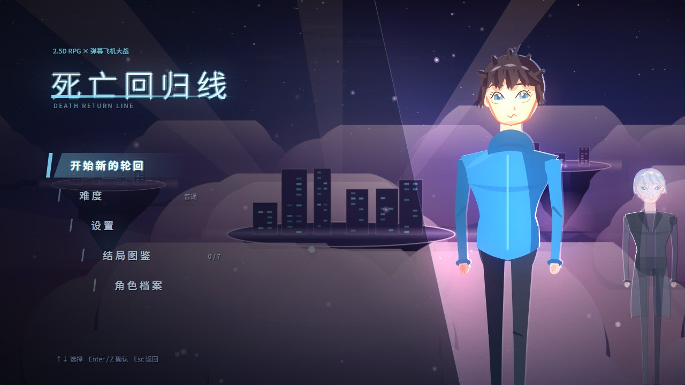

---

## 目录

- [这是什么](#这是什么)
- [技术选型](#技术选型)
- [启动方式](#启动方式)
- [操作说明](#操作说明)
- [系统清单](#系统清单)
- [自测结果](#自测结果)
- [已知问题](#已知问题)
- [目录结构](#目录结构)
- [许可](#许可)

---

## 这是什么

两种玩法无缝切换的叙事游戏。

**2.5D RPG 探索** —— 45° 斜投影伪 3D。角色与建筑按 Y 轴层级排序，物件有真实高度（顶面提亮、侧面压暗、斜投影接地影），高架管道与栈桥可以从下方走过。在这里对话、读那些没人会读的东西、找躲藏点抱着膝盖发抖、走上发射台。

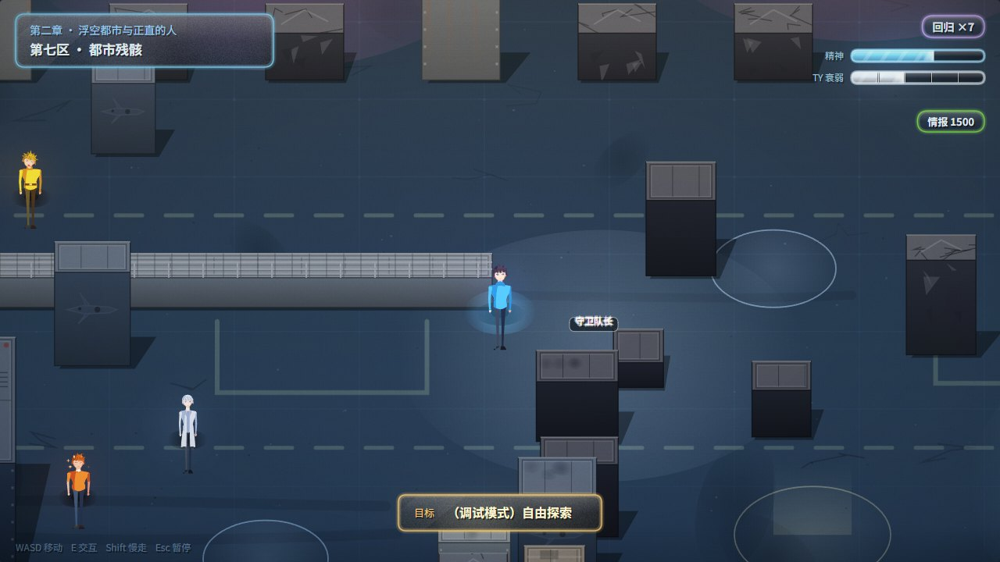

**弹幕飞机大战** —— 进入空域后切换。敌弹统一暖色、己弹统一冷色，所有蓄力攻击都有预警线，战斗区内会压低背景明度与饱和度保证弹幕可读。6 场 Boss 战，每场每档难度都是重新设计的一套弹幕。

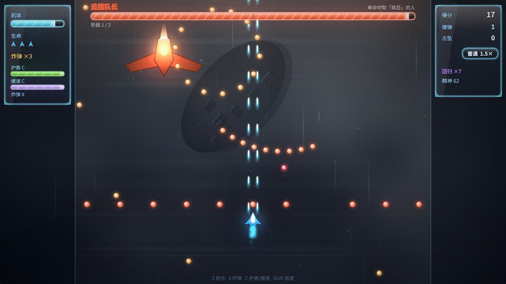

**死亡回归** —— 死亡通常**不是** Game Over。画面扭曲、颜色失真、时间倒流，立绘碎裂后重组，然后你回到存档点：你和 TY 保留全部记忆，其他所有人都不记得。你会看着同一个人一次又一次死在同一分钟。

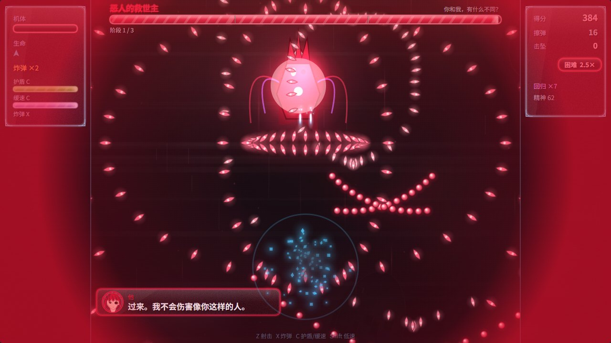

---

## 技术选型

**核心决策是「不引入任何依赖，也不生产任何素材文件」**，所有内容用代码表达。这带来两个直接好处：仓库只有几百 KB 代码、`file://` 下双击即开；以及所有美术参数都是可调的数字，改一个常量就能重新配色整个区域。

| 层面 | 选择 | 为什么 |
|---|---|---|
| 渲染 | **Canvas 2D**，逻辑分辨率固定 1280×720 | 不需要 3D，2D 的绘制顺序就是天然的图层系统；固定逻辑分辨率让所有坐标是常量，构图可以写死 |
| 缩放 | 等比缩放 + 黑边，后备缓冲按**实际设备像素**分配（总像素封顶 2560×1440） | 矢量美术放大不损失，直接按原生分辨率渲染就是免费的清晰度 |
| 音频 | **Web Audio** 实时合成 | 22 段 BGM + 全部音效 + 13 个角色各自不同的合成哔声，如果做成音频文件是几十 MB |
| 动画 | 自写补间 / 时间轴 / 协程调度器（`js/core/tween.js`） | 只需要几百行，换来对时间缩放、顿帧、慢放的完全控制 |
| 弹幕脚本 | **generator 协程**：`yield 30` 等 30 帧、`yield {until: fn}` 等条件 | 一个 Boss 阶段就是一个 generator，可读性远高于状态机 |
| 过场 | **声明式步骤数组 + 解释器**，支持 `par` 并行、`if` 条件、`paint` 自定义绘制 | 2161 个演出步骤是数据不是代码，可以被工具静态校验 |
| 立绘 | 参数化矢量人物：骨架 + 赛璐璐分层 + 逆光轮廓 | 13 个角色共用一套渲染器，差异全在数据里（体型、头身比、呼吸节律、发型、情绪） |
| 存档 | localStorage，存档点 = 章节 + 节拍 + 一份扁平可克隆的剧情状态 | 不做对象图序列化；回归和读档走同一套机制：从该节拍重建场景再叠加差异 |
| 语言 | ES5 风格 + IIFE 挂全局 `G` 命名空间，`<script>` 按序加载 | 无构建步骤，任何浏览器直接跑，也方便逐文件调试 |

**性能做法**：子弹全部预渲染成离屏精灵后 `drawImage`，不用 `arc()` 逐个描边，全项目零 `shadowBlur`（改用预渲染径向光斑）；对象池预分配；静态背景层烘进离屏画布，每帧只重绘云、粒子、光晕。

**后处理链**：泛光用 `color-burn` 叠 50% 灰做高光提取（数学上等于 `max(0, 2L−1)` 的硬阈值，比逐通道自乘准确，饱和色不会整片发光）→ 上暖下冷分离色调 → 椭圆暗角 → 常驻胶片颗粒。毛玻璃是真磨砂：每帧把画面降采样模糊进缓冲，UI 面板从里面取样。

---

## 启动方式

### 直接玩

**双击 `index.html`。** 不需要 Node、不需要服务器、不需要联网。

推荐 Chrome / Edge / Firefox。首次点击「点击进入」是为了满足浏览器对 Web Audio 的用户手势要求。

也可以放进任意静态服务器：

```bash
python -m http.server 8000     # 然后打开 http://localhost:8000
```

### 调试跳转

加 `?debug=1` 显示状态 HUD，`&jump=` 直达任意位置：

```
index.html?debug=1&jump=map:storm         直达某区域
index.html?debug=1&jump=boss:boss6        直达某 Boss（&diff=hard 指定难度）
index.html?debug=1&jump=cut:c4_tear_shot  直达某段过场
index.html?debug=1&jump=end:if            直达某个结局
index.html?debug=1&jump=ch:3              从第三章开头开始
index.html?debug=1&jump=ret               看死亡回归演出
index.html?debug=1&jump=enemy:blocker     小怪试验场（只出这一种）
```

### 跑自验证工具

需要 Node 18+ 与 Playwright（会自动使用系统安装的 Chrome / Edge）：

```bash
npm i -D playwright

node tools/verify.js       # 静态完整性校验（剧情图 / 资源引用 / 结局条件 / 弹幕配色）
node tools/regress.js      # 功能回归（真实浏览器里按键验证已修 bug）
node tools/shots.js        # 全场景批量截图 → tools/shots/
node tools/playthrough.js  # 模拟真实按键从标题开始通关
node tools/probe.js "cut:c4_puppet_beg" 3000 "G.Dlg.actors.length"   # 取任意运行时状态
```

`tools/artlab.html` / `artlab2.html` 是立绘调参台，可以直接在浏览器里拖参数看人物变化。

---

## 操作说明

| 按键 | 作用 |
|------|------|
| `WASD` / `方向键` | 移动（地图行走 / 战机机动，八方向带惯性） |
| `Z` `J` `空格` | 射击 · 确认 |
| `E` `Enter` | 交互 · 对话 |
| `X` `K` | 技能 1 —— 清屏炸弹（清空全屏弹幕 + 范围伤害 + 无敌帧） |
| `C` `L` | 技能 2 —— 护盾 / 时间缓速（交替可用，各自独立冷却） |
| `Shift` | 低速精确移动（显示判定点与判定环） |
| `Ctrl` | 加速文本 / 快进过场（5×，按住生效） |
| `Tab` | 机库内切换页签 / 对话回顾 |
| `Esc` `P` | 暂停（含设置、对话回顾、返回标题） |
| `Alt` + `F` | 全屏 |
| `Alt` + `M` | 静音 |

**受击判定是点判定**：只有战机正中央那个小红点被碰到才算受伤。子弹擦过判定点附近会累积「擦弹」得分——贴着弹幕飞是有奖励的。

支持触屏（左半屏虚拟摇杆）。**暂不支持手柄与键位重绑定。**

---

## 系统清单

### 内容规模

| 项 | 数量 |
|---|---|
| 区域 | **6** —— 锈港废弃机库 / 第七区都市残骸 / 雷云走廊 / 第九车间 / 无名祭坛 / 核心空域 |
| 剧情节拍 | 105 |
| 过场 | 48 段，共 **2161** 个演出步骤 |
| 对话 | 91 段剧情对话 + 193 条 NPC / 可读物台词 |
| 角色 | **13**，每人独立主色、体型姿态、头身比、呼吸节律、14 种情绪、以及完全不同的合成哔声 |
| 小怪 | **12** 种，每种「外观 + 移动 + 攻击」三位一体 |
| Boss | **6 场 + 1 场彩蛋**，16 个阶段 × 3 档难度 = 48 套独立弹幕脚本 |
| 战场 | 11 个 |
| NPC / 可交互点 | 23 / 43 |
| 结局 | **7** —— 1 好、5 坏、1 彩蛋（含可操作决战，你会换一个人开飞机） |
| BGM | 21 段程序化主题，可分层抽层做变奏与静音 |
| 代码 | 21204 行 JS（core 2211 / render 4808 / systems 1594 / data 8297 / scenes 4294）+ 工具 1242 行 |

### 核心系统

**死亡回归**（`js/systems/loop_system.js`）
- 情报跨轮回保留，用来在下一轮做不同的选择
- **精神值**每次回归下降（`6 − 回归缓冲等级 × 1.2`，下限 1.5）；降到 20 时给出「是否放弃回归」的选择而不是直接判死
- **TY 的副作用**每次复活累积一级（共 5 级）：白发、驼背、咳嗽、手抖、哔声出现杂音断续——立绘和声音会真的一级一级衰老
- 复活瞬间他会继承死前几秒的痛苦
- 部分死亡是**真正的终点**：存档点失效、能力被封印、或精神已经撑不住

**存档**（`js/core/save.js`）
- 剧情存档点自动落盘，标题界面「继续」显示章节 · 回归数 · 精神值
- 「开始新的轮回」在有存档时需二次确认；到达结局自动清档
- 另存结局图鉴、角色档案、最高章节、设置；带结构版本号与类型校验

**机库整备**（`js/scenes/scene_hangar.js`）—— 5 条升级线各 5 级，`120 + 等级 × 110` 点递增
- 火力强化（弹道数 + 单发伤害）/ 装甲强化（耐久上限）/ 弹药扩容（每两级 +1 炸弹）/ 推进优化（机动 +6%/级）/ 回归缓冲（减少精神损耗）
- 另有情报日志与角色档案页签

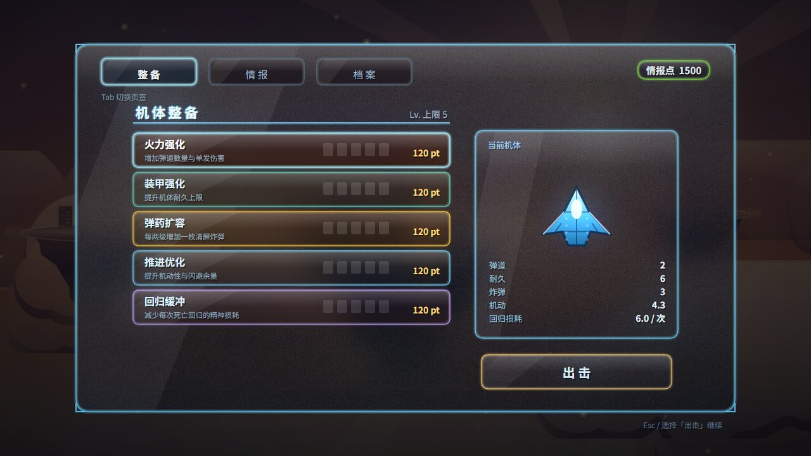

**三档难度**（标题或暂停菜单切换，中途可改）

| 维度 | 简单 | 普通 | 困难 |
|------|------|------|------|
| 小怪出怪量 | 稀疏 · 单一种类 | 中等 · 2–3 种混合 | 密集 · 4 种以上混合编队 |
| 小怪血量 / 速度 | 低 / 慢 | 中 / 中 | 高 / 快 |
| Boss 血量 / 弹幕 | 低 / 稀疏规律 | 中 / 中等复合 | 高 / 密集混沌 |
| 预警时间 | 很长 | 正常 | 极短 |
| 生命 / 炸弹 | 5 / 4 | 3 / 3 | 2 / 2 |
| 奖励倍率 | 1× | 1.5× | 2.5× |

难度只影响手感，不影响能达成哪些结局。

**战斗反馈** —— 顿帧（受击 70ms / 转阶段 130ms / Boss 死亡 200ms）、慢放、Boss 血条按**真实转阶段血量**打刻度而不是均分、擦弹计分、护盾兵护盾可独立击破。

**可访问性**
- 画面震动开关（晕动症友好）
- **闪光与故障特效**开关（光敏友好）：选「削弱」后全屏闪光压到 14% 亮度并放慢 1.6×、故障撕裂压到 22%，演出信息保留。在 `Fx.flash` / `Fx.glitchBurst` 内部拦截，所有调用点自动生效
- 文本速度三档、判定点常显、自动射击
- 弹幕配色规则由工具静态校验，敌弹一旦用冷色就报错

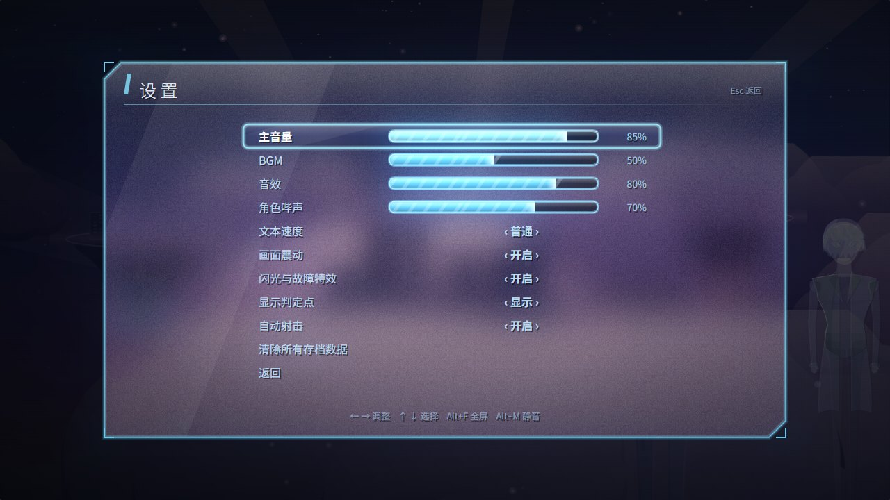

### 结局与图鉴

7 个结局，每个坏结局都有独立的「世界之后」演出，节奏与画面各不相同：缓慢漫长的坠落 / 孤独而理性的崩溃 / 突然到来不及反应的全灭 / 压抑扭曲的「秩序」/ 什么都没有的寂静。

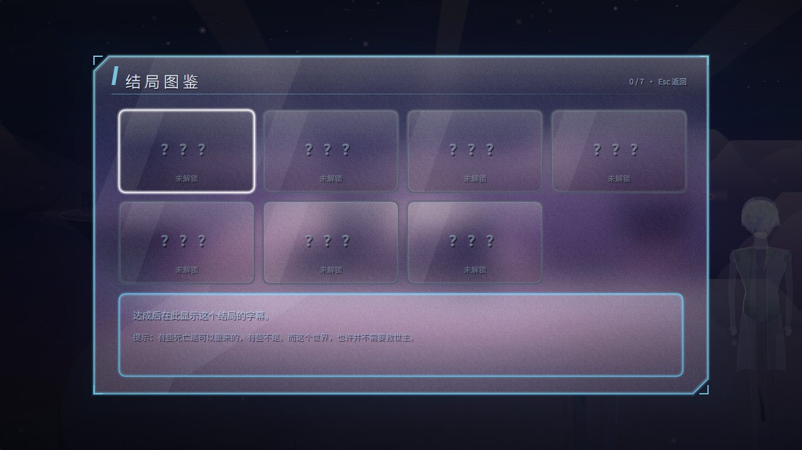

游戏不会告诉你怎么解锁它们。但有几件事值得记住：

- 老人说过：「有时候，救人的不是最强的那个，而是最不想放弃的那个。」
- TY 说过：「我的计算中，有一个变量我无法预测——那就是『普通人选择站起来』的概率。」
- 疯子说过：「你以为只有你和那个科学家能救世界？嘿嘿……等着瞧吧。」

<table>
<tr>
<td>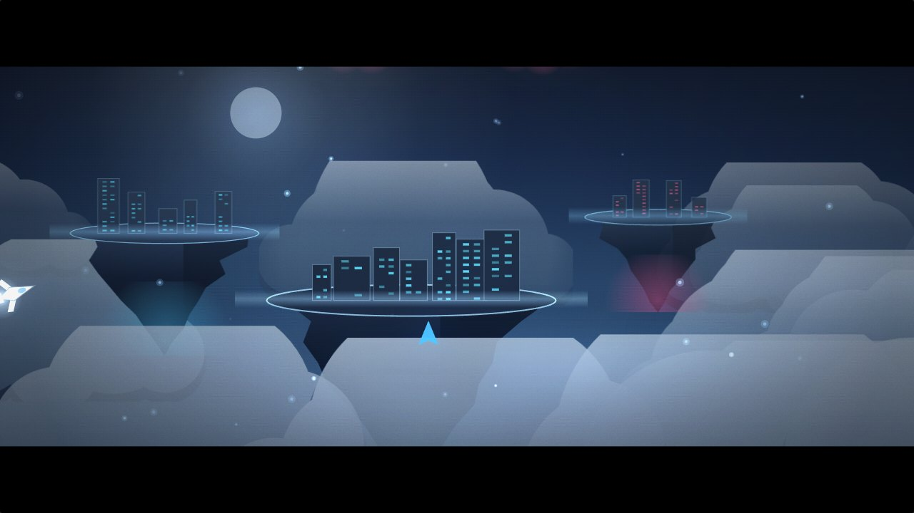</td>
<td>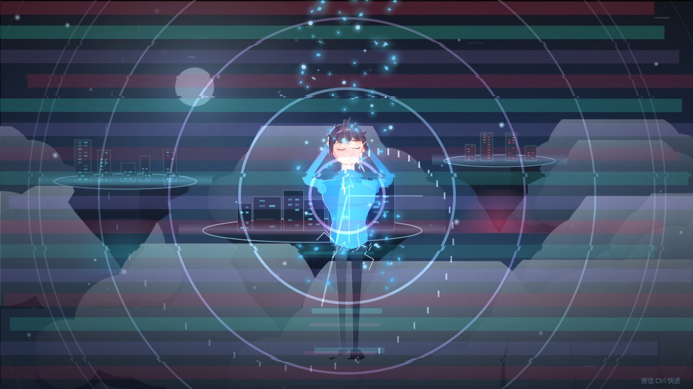</td>
</tr>
<tr>
<td>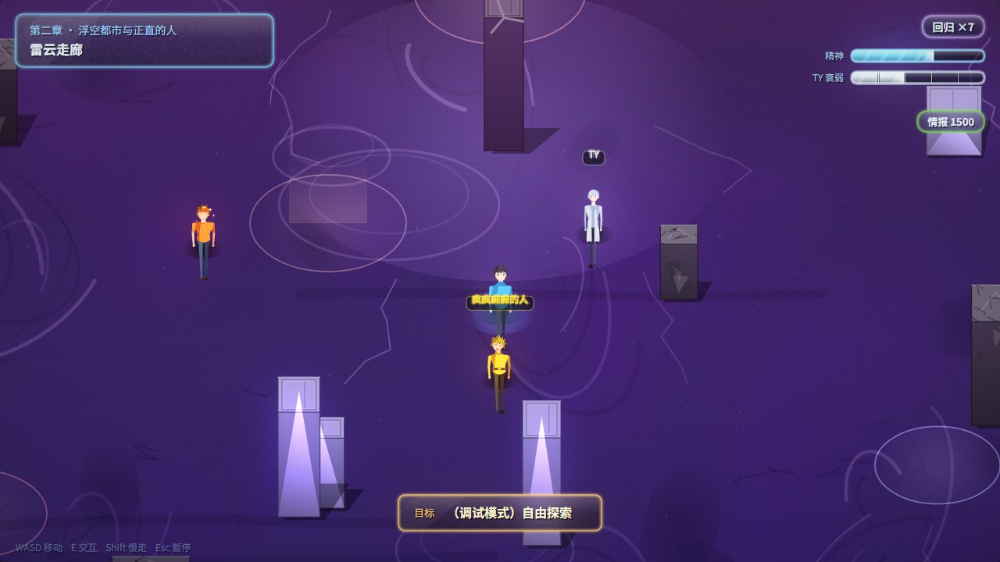</td>
<td>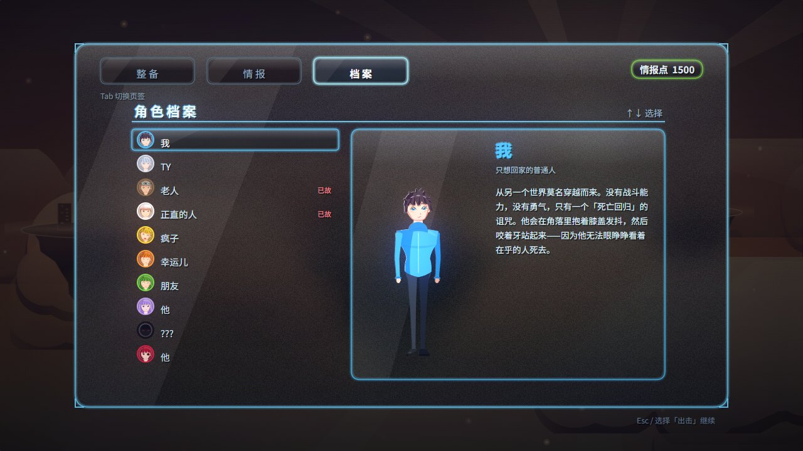</td>
</tr>
</table>

---

## 自测结果

项目自带四套工具，下面是最近一次的真实运行结果。

### 静态完整性校验 —— `node tools/verify.js` ✅ 全部通过

```
=== 统计 ===
  beats 105   cuts 48   battles 11   mapBeats 14   npcs 23   zones 43
  cutsceneCount 48   steps 2161   dialogueLines 91   talkLines 193
  bossPhases 16   bosses 7   enemies 12   chars 13   endings 7   regions 6
  bulletColorSamples 448568
=== 校验 ===
  ✓ 全部通过
```

校验内容：每个剧情节拍引用的过场 / Boss / 战场 / BGM / 区域目标是否存在；每个 NPC 与可读物的对话是否存在；出口是否双向互通；每段过场的每个步骤类型 / painter / 角色 / 音效是否有效；每个 Boss 的每档难度每个阶段是否都有弹幕脚本（且三档不是同一个）；每种小怪是否三位一体齐全；角色哔声是否互不相同；7 个结局的触发条件是否真的可达；5 个坏结局是否都有独立的「世界之后」段落。

**弹幕配色语法**校验的做法是：拿一个记录型 api 空跑每个 Boss 阶段与每种小怪的攻击脚本，收集全部 448568 次开火调用的颜色按色相判定，敌弹一旦用了冷色（会和己弹混淆）就报错。

### 功能回归 —— `node tools/regress.js` ✅ 7/7

在真实浏览器里合成按键、读取运行时状态验证：

```
  ✓ 护盾冷却中炸弹可用        shieldCd=11696  bombs 3→2
  ✓ 护盾兵护盾可击破
  ✓ 护盾兵可被击杀
  ✓ 存档点落盘并可恢复        ch=3 情报点 520
  ✓ 章节选择不再掐死 IF 线    uprightAlive=true
  ✓ boss2 真实转阶段阈值      [1,0.62,0.26]
  ✓ 顿帧生效且自动恢复        during=150 after=0

全部通过   (7/7)
```

### 场景冒烟 —— 13 个入口，全部零报错

`title` / `map:camp` / `map:core` / `boss:boss1` / `boss:boss6` / `boss:boss6_if` / `hangar` / `end:good` / `end:if` / `end:badB` / `ret` / `enemy:shielder` / `ch:3`

### 截图 —— `node tools/shots.js` ✅ 67/67 全部通过，零页面错误

### 性能

Chromium 无节流、1280×720：

| 场景 | FPS | JS 堆 | 说明 |
|---|---|---|---|
| boss6 困难（227 发敌弹在场） | 240 | 10 MB | 5 分钟压力测试后堆与画布数均无增长 |
| 核心空域地图 | 208 | 11 MB | |
| 标题 | 240 | 10 MB | |

p99 帧时 5 ms。后处理链（泛光 + 调色 + 逆光轮廓）没有可测量的开销。

### 分辨率

后备缓冲按实际设备像素分配、总像素封顶 2560×1440，实测：

| 窗口 | dpr | 画布后备 | 上采样 |
|---|---|---|---|
| 1366×768 | 1 | 1365×768 | **1.00×** |
| 1920×1080 | 1 | 1920×1080 | **1.00×** |
| 2560×1440 | 1 | 2560×1440 | **1.00×** |
| 1920×1080 | 2 | 2560×1440（封顶） | 1.50× |
| 3840×2160 | 1 | 2560×1440（封顶） | 1.50× |

也就是 1440p 及以下按原生分辨率渲染，超出封顶的部分才做一次上采样——封顶是性能旋钮，可在 `js/core/game.js` 的 `MAXPX` 调整。

---

## 已知问题

如实列出，欢迎 PR。

**美术**
- 头部渲染是当前最明显的短板：五官偏平、头发缺少发丝分组、小尺寸下手部不够清晰。环境、光照、调色已经过一轮重做，人物头部尚未
- 地图上 NPC 名字标签会与角色精灵重叠

**内容与引导**
- 情报日志是设定文本，不是可操作的下一轮指引
- 没有「已看过」标记，也没有真正的跳过（只有按住 `Ctrl` 的 5× 快进）——为第 2 到第 7 个结局重玩摩擦较大
- 结局图鉴只有一条全局提示，没有逐结局的解锁进度或路线提示

**战斗**
- `phantom` / `bouncer` / `swarm` 的弹速被难度倍率乘了两次
- 连续弹墙的缺口每次独立重随，理论上存在不可躲的组合
- 部分小怪的 AI 边界用的是画面宽度而不是战斗区宽度，会在战斗区外开火
- 激光的判定宽度是视觉光晕的约 1/3
- 没有练习模式、单 Boss 重试与成绩记录

**其他**
- 不支持手柄，不支持键位重绑定，没有字号选项，仅中文
- `tools/playthrough.js` 连续跑到 400 秒左右会 `Target crashed`。已用 5 分钟单场景压力测试排除游戏侧泄漏（堆与画布数均不增长），判断为 headless Chromium 在 240fps 无节流 + 持续合成按键下的环境问题，但尚未定位

---

## 目录结构

```
index.html              入口（按序加载所有脚本）
css/style.css           页面外壳 + 启动页
js/core/                循环、场景栈、输入、音频、补间、存档、调试
js/render/              程序化背景、矢量立绘、屏幕特效与后处理、毛玻璃 UI
js/data/                角色、地图、小怪、Boss、对话、过场、结局、剧情图
js/systems/             对话、过场解释器、死亡回归、结局调度、暂停
js/scenes/              标题、地图、弹幕、机库、过场、结局
tools/                  自验证工具 + 立绘调参台
docs/img/               README 配图
```

---

## 许可

[MIT](LICENSE)。代码与内容均可自由使用、修改、再发布。

---

*战斗是叙事的结果，不是叙事的起点。*
